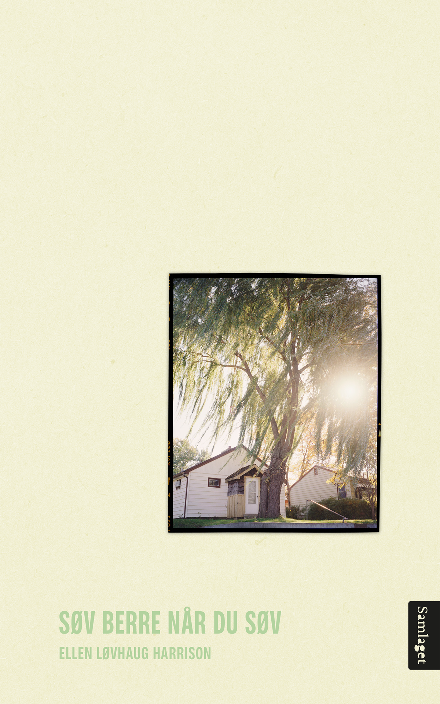

"Ei dotter sit i Noreg og ser på filmopptak av ein far og ei tid i USA ho knapt kan hugse. I heimefilmane ser ho eit skjær av det livet faren såg for seg då mora, storesystera, ho og han var ein familie."
  
Kjøp den hjå <a href="https://samlaget.no/collections/varens-boker-2023/products/sov-berre-nar-du-sov-1" style="color:#a8d3a0;">Samlaget</a>!

---

<b style="color:#a8d3a0;">2024</b>   

<a href="https://ordigrenseland.no/arrangement/gratis-vorspiel-med-kamilla-og-ellen-2/" style="color:#a8d3a0;" target="_blank" rel="noopener noreferrer">Vorspiel med Kamilla og Ellen</a>  
Ord i Grenseland, Fredrikstad  
12.10  

<a href="https://tekstallmenningen.no/butikk/kunst-kultur/blekk-poesi-i-villniset/" style="color:#a8d3a0;" target="_blank" rel="noopener noreferrer">Blekk, "Kart og terreng"</a>     
12.06  

<a href="https://blekkskrift.no/" style="color:#a8d3a0;" target="_blank" rel="noopener noreferrer">Blekk Live</a>  
Landmark, Bergen  
12.06  

<a href="https://nynorsk.no/aasentunet/arrangement/debutantpraten-samtale-mellom-monica-goksoyr-og-ellen-harrison/" style="color:#a8d3a0;" target="_blank" rel="noopener noreferrer">Debutantpraten: Samtale mellom Monica Goksøyr og Ellen Harrison</a>  
Festspela, Aasentunet, Ørsta  
08.06  

<a href="https://nynorsk.no/aasentunet/arrangement/debutantane-les-monica-goksoyr-og-ellen-harrison/" style="color:#a8d3a0;" target="_blank" rel="noopener noreferrer">Debutantane les: Monica Goksøyr og Ellen Harrison</a>  
Festspela, Aasentunet, Ørsta  
08.06  

<a href="https://litteraturfestival.no/shows/hagefest-pa-nansenskolen/" style="color:#a8d3a0;" target="_blank" rel="noopener noreferrer">Hagefest på Nansenskolen</a>  
Norsk litteraturfestival, Lillehammer   
29.05    
  
  
<b style="color:#a8d3a0;">2023</b>  

<a href="https://www.litteraturhuset.no/nb/arrangement/de-store-debutantdagene-2023" style="color:#a8d3a0;" target="_blank" rel="noopener noreferrer">De store debutantdagene</a>  
Litteraturhuset, Oslo  
06.12   

<a href="https://ordigrenseland.no/arrangement/poetenes-grenseland/" style="color:#a8d3a0;" target="_blank" rel="noopener noreferrer">Poetenes grenseland</a>  
Ord i Grenseland, Fredrikstad  
12.10   

<a href="https://framtida.no/2023/08/06/i-bokhylla-ellen-harrison-kunne-lese-virginia-woolf-i-det-uendelege" style="color:#a8d3a0;" target="_blank" rel="noopener noreferrer">Framtida.no, "I bokhylla: Ellen Harrison kunne ha lese Virginia Woolf i det uendelege"</a>  
06.08  

<a href="https://framtida.no/2023/07/30/lesetips-til-midtsommaren-fra-fire-debutantar" style="color:#a8d3a0;" target="_blank" rel="noopener noreferrer">Framtida.no, "Lesetips til midtsommaren frå fire debutantar"</a>    
30.07  

<a href="https://samtiden.no/bok/2023/da-hadde-boka-blitt-fiks-og-darleg-og-ingen-hadde-fatt-lesa-den" style="color:#a8d3a0;" target="_blank" rel="noopener noreferrer">Samtiden, "– Då hadde boka blitt fiks og dårleg og ingen hadde fått lesa den"</a>  
07.06

<a href="https://litteraturfestival.no/shows/poesi-og-etterrettelighet/" style="color:#a8d3a0;" target="_blank" rel="noopener noreferrer">Poesi og etterrettelighet</a>   
Nansenskolen, Norsk Litteraturfestival, Lillehammer   
24.05  

<a href="https://www.nm.no/app/uploads/2023/05/NT02-23-2.pdf" style="color:#a8d3a0;" target="_blank" rel="noopener noreferrer">Norsk Tidend, "Imponerande teft og tryggleik"</a>    
05.05  

<a href="https://fb.me/e/VHgzKUDO" style="color:#a8d3a0;" target="_blank" rel="noopener noreferrer">Kva er samanhengen mellom levd liv og lyrikk?</a>    
Litteraturhuset i Trondheim  
25.04  

<a href="https://www.hardanger-folkeblad.no/lyrisk-samarbeid-i-kinsarvik/s/5-22-503326" style="color:#a8d3a0;" target="_blank" rel="noopener noreferrer">Hardanger Folkeblad, "Lyrisk samarbeid i Kinsarvik"</a>    
04.04   

<a href="https://www.studvest.no/uib-student-ellen-har-skrive-bok-om-lengsla-etter-ein-far/" style="color:#a8d3a0;" target="_blank" rel="noopener noreferrer">Intervju i Studvest</a>     
29.03  
  
<a href="https://fb.me/e/3l3sRTlcf" style="color:#a8d3a0;" target="_blank" rel="noopener noreferrer">Poesikveld</a>   
Kinsarvik bibliotek   
13.03 

<a href="https://www.bt.no/kultur/i/4oW7J6/et-harmonisk-farsportrett" style="color:#a8d3a0;" target="_blank" rel="noopener noreferrer">Bergens Tidende, "Et harmonisk farsportrett"</a>    
25.02  

<a href="https://fb.me/e/7NlwTMhiS" style="color:#a8d3a0;" target="_blank" rel="noopener noreferrer">Lansering, *Søv berre når du søv*</a>  
Skrivekunstakademiet, Bergen    
24.02  

<a href="https://fb.me/e/3mRjyNnb7" style="color:#a8d3a0;" target="_blank" rel="noopener noreferrer">Lansering, *Søv berre når du søv*</a>   
Sagene bokhandel, Oslo   
16.02      

<a href="https://www.vaganavisa.no/nyheter/i/RGOb2r/ellen-gir-ut-sin-foerste-bok-gir-pandemien-noe-av-aeren" style="color:#a8d3a0;" target="_blank" rel="noopener noreferrer">Intervju i Våganavisa</a>    
04.02    

<a href="https://www.lofotposten.no/en-liten-ting-lareren-gjorde-satte-sine-spor-fy-flate-syns-han-det-var-sa-bra/f/5-29-890679" style="color:#a8d3a0;" target="_blank" rel="noopener noreferrer">Intervju i Lofotposten</a>    
29.01 
    
    
<b style="color:#a8d3a0;">2022</b>  

<a href="https://www.synogsegn.no/2023/under-arbeid-ellen-lovhaug-harrison/" style="color:#a8d3a0;" target="_blank" rel="noopener noreferrer">Syn og segn, "Under Arbeid: Ellen Løvhaug Harrison"</a>      
28.08 

    
<b style="color:#a8d3a0;">2020</b>  
  
<a href="https://fb.me/e/87ye5yfYl" style="color:#a8d3a0;" target="_blank" rel="noopener noreferrer">Lansering, *Ett og ett kronblad nå*</a>   
Cornerteateret, Bergen   
16.06  

    
<b style="color:#a8d3a0;">2019</b>  

<a href="https://fb.me/e/1tBvcMn1P" style="color:#a8d3a0;" target="_blank" rel="noopener noreferrer">Poesidigg</a>   
Café Opera, Bergen  
28.11

<a href="https://www.litteratursymposiet.no/program/tidlegare-litteratursymposium/2019/lesestund" style="color:#a8d3a0;" target="_blank" rel="noopener noreferrer">Lesestund, studentar ved Skrivekunstakademiet</a>   
Litteratursymposiet i Odda  
11.10  
